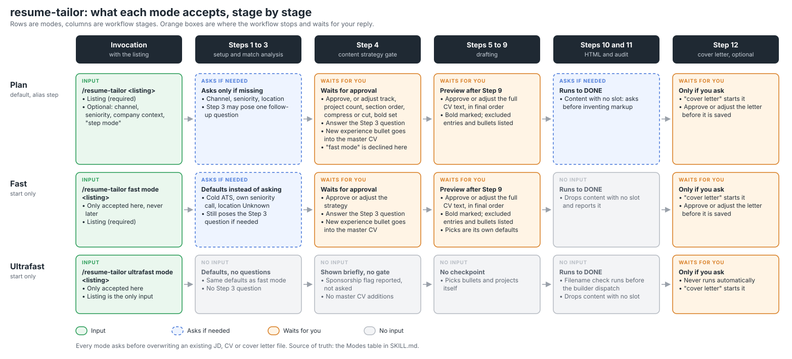

# Setup

Claude Code and Codex are interchangeable here. `AGENTS.md` holds the standing rules;
`CLAUDE.md` is a symlink to it, so both tools read the same file. The `resume-tailor` skill
is written for Claude Code and lives in `.claude/skills/`; `.agents/skills/resume-tailor`
is a symlink to it so Codex finds it too. Codex ignores the Claude-only parts (tool
pre-approval, the `guard.py` hooks). Edit the real files, not the symlinks.

In Claude Code, Steps 1 to 9 run on Opus at high effort (`model`/`effort` in the skill
header). Step 10 assembly goes to the `cv-html-builder` agent on Sonnet at medium effort
(`.claude/agents/cv-html-builder.md`), which only the skill may dispatch, enforced by a
hook in `.claude/settings.json`. Codex does every step itself.

## Layout

- `Dexter_Fernandes_Master_CV.md` -- the single master resume, shared by every track.
- `Dexter_Fernandes_Resume_template.html` -- the shared output template.
- `CV/`, `Robotics/`, `LLM/`, `SLAM/`, `Software/`, `PLC/` -- one directory per track.
  Run the workflow from the repo root; it picks the track and writes the CV to
  `<Track>/Resumes/HTML/`.
- `JDs/` -- every saved job listing, all tracks, as `<Position>_<Company>_<Location>.md`.

## Running an application

```
/resume-tailor <paste the job listing>   # Claude Code
$resume-tailor <paste the job listing>   # Codex
```

or just paste a listing and ask for a tailored CV. Every route runs the same skill.

Modes (plan, fast, ultrafast; "step mode" is an alias for plan) are defined in the Modes
table in `.claude/skills/resume-tailor/SKILL.md`. Fast and ultrafast are accepted only
alongside the listing. The diagram below summarises the table; if they disagree, the
table wins.



Step 12, the cover letter, is optional and runs only when asked. The draft is passed
through the `humanizer` skill and shown for approval; once approved it is saved to the
track's `Cover Letters/HTML/` from `Dexter_Fernandes_Cover_Letter_template.html` and
audited.

## Exporting to PDF

After Step 11, render with `html2pdf.sh` from the repo root:

```bash
./html2pdf.sh                        # build every missing or stale PDF under */*/HTML/
./html2pdf.sh CV SLAM/Resumes        # limit the sweep to tracks or directories
./html2pdf.sh --force CV             # rebuild regardless of timestamps
./html2pdf.sh path/to/CV.html        # render one file, always
./html2pdf.sh -o ~/cv.pdf CV.html    # render one file to a chosen path
```

PDFs from `<Track>/<Section>/HTML/` land in the sibling `pdf/` directory under the same
basename. Rendering is headless Chrome (set `CHROME_BIN` to override detection), fully
offline, with Archivo loaded from `assets/fonts/`. Local static fonts matter: the variable
font Google Fonts serves cannot be embedded properly by Chrome's PDF backend, so it falls
back to Type 3 glyph drawings (about 4x the file size, weaker ATS text layer). If the
fonts are missing they are fetched automatically; `./html2pdf.sh --refresh-fonts` re-fetches
them.

Each PDF is checked after rendering, and problems are flagged with `!` on its line:
a resume that is not two pages, Type 3 fonts or Archivo missing, and too little extractable
text for an ATS. Warnings do not change the exit status; a failed render does.

The script only counts pages, so still open the PDF and check for stranded headings or a
single orphaned bullet on page 2.

## Keeping the master CV current

`Dexter_Fernandes_Master_CV.md` is the only source of truth; the workflow never edits it. Add
new roles, projects, metrics and skills there by hand (or ask the agent to, explicitly), and
commit the change. Do not create per-track copies: every track reads the root file.
PLC content stays out of the master; `PLC/` tailors from transferable experience only.
